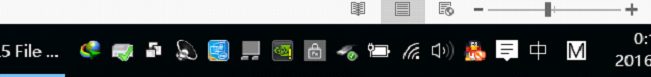
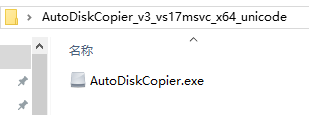
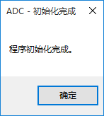
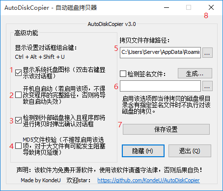
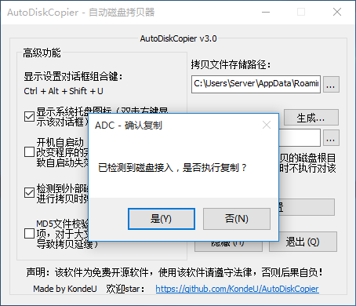
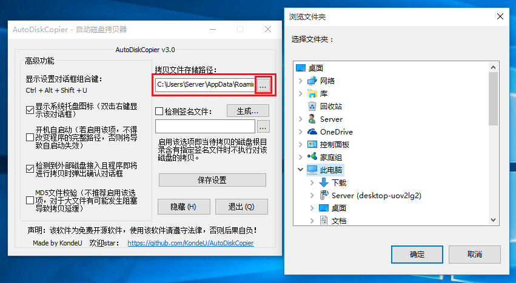
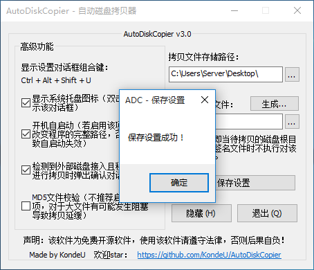

# AutoDiskCopier

开源一个**自动磁盘拷贝器（U盘小偷）**。使用该软件请遵守相关法律法规，未经他人许可访问及拷贝他人文件是违法行为。

这个应用是我高二刚接触Windows程序设计时开始写的，后来被我改版重写了一番，又成为了我大学时的大作业项目还获得了优秀大项目（然鹅我并不是计算机/软件专业的）…囧rz

（PS：每隔几年回过头来看看自己曾经写的代码，大概都觉得很挫吧）

AutoDiskCopier的更多<del>扯淡</del>内容请访问：<https://tis.ac.cn/blog/kongdeyou/auto_disk_copier>

AutoDiskCopier开源代码地址：<https://github.com/KondeU/AutoDiskCopier>

---

## 使用手册

### 引言

非常感谢您抽空阅读Win32应用程序“自动磁盘拷贝器”的用户手册。本手册将向您详细展示该软件所能实现的功能及其操作方法，并为软件的维护与反馈提供了必要的信息。

### 软件概述

#### 软件功能

该软件的主要功能为，在运行该软件时，该软件会监测USB端口，当检测到有移动磁盘接入时，对接入的设备内的文件进行静默拷贝。该软件可用于对移动磁盘的文件备份或文件截取。
该软件提供了一些可供用户配置的附属功能，合理配置可对程序进行一些个性化的扩展。
用户可配置的功能有：

- 决定是否在程序后台运行时显示系统托盘图标（系统托盘图标，即Windows操作系统桌面底端的任务栏右方的小图标，如下图）；

  

- 决定该软件是否开机自启动；

- 决定是否弹出确认复制移动磁盘的对话框，若勾选该选项框，则软件在检测到有移动磁盘接入时，会弹出对话框，用户可选择是否对该磁盘进行拷贝；

- 决定是否启用MD5文件校验（MD5值是一种Hash值，可用于校验两个文件是否相同），该功能可以保证拷贝文件的准确性，若MD5校验失败，文件会重新复制，若连续校验失败次数超过3次，将跳过对该文件的复制。启用该功能会影响拷贝速度，尤其针对大文件。在不启用该功能时，软件对磁盘文件的平均拷贝速度大约为60MB/s。测试结果表明，对于500MB左右大小的文件，MD5校验的时间大约为40s，因此，若开启此功能，在对大文件进行拷贝时则有可能发生阻塞；

- 自定义拷贝到的文件的存储路径；

- 检测签名文件。若勾选该选项框，则软件在对接入的移动磁盘进行拷贝前会先对该磁盘的根目录进行检索，若找到指定的签名文件且内容一致，则跳过对该磁盘的拷贝。

#### 运行环境

本软件要求运行在PC及其兼容机上，处理器为小端序架构（MD5算法以小端序处理）。软件需要运行在Windows NT及高版本上，发行前用于测试的操作系统为Windows 10。

用户需要保证存储路径所在的磁盘有足够的空间，否则拷贝任务将失败。

#### 应用分析

该软件由纯Win32代码编写，相较于MFC、Java或其他方式开发出的程序，该程序的可执行文件体积小，代码执行效率高，内存占用少，不依赖于更多的外部链接库。Release构建产物大小仅为50KB。在执行拷贝任务时，静默拷贝，内存占用的峰值低，CPU资源消耗小，对电脑的普通使用无影响，是一款轻量级的工具。

### 使用说明

#### 启动程序

双击该软件即可启动。

若用户为第一次启动该软件或该软件的配置文件失效，该软件将会自动执行初始化操作，并在完成初始化操作后显示“完成初始化”的对话框。以后再运行该软件，将不再弹出该对话框。

#### 激活设置窗口

软件启动后，不会显示设置窗口。若要显示设置窗口，可同时按下Ctrl + Alt + Shift + U键。或者若在设置界面勾选了显示系统托盘图标的选项，则也可以通过鼠标右键双击系统托盘图标以显示设置窗口。

#### 设置

如图所示，分1-8点进行详细说明：

1. 若勾选该选项框，则该软件在后台运行时会显示系统托盘图标，用户可以通过右键双击该图标以显示设置对话框。

2. 若勾选该选项框，则该软件会通过读写注册表为该软件自身添加开机启动项，当windows启动时，该软件自启动。勾选该选项后，不能改变该软件的位置及文件名，否则自启动将无效。

3. 若勾选该选项框，则软件在检测到有移动磁盘接入时，会弹出一个确认对话框并进行等待，用户可选择是否对该磁盘进行拷贝，若用户选择“是”，则对磁盘进行拷贝（注：用户选择“是”后，若启用检测签名文件且签名文件存在，将跳过拷贝）。

   

4. 若勾选该选项框，则软件在拷贝文件时执行MD5文件校验，保证拷贝文件的准确性。若MD5校验失败，文件会重新复制，若连续校验失败次数超过3次，将跳过对该文件的复制。启用该功能会在一定程度上影响拷贝速度，尤其在大文件上更加明显。测试结果显示，对于100MB以内的文件，MD5校验的时间在5s以内。但对于500MB左右大小的文件，MD5校验的时间大约为40s，因此，若开启此功能，在对大文件进行拷贝时则有可能发生阻塞，影响拷贝速度。

5. 填写一个正确的路径或选择一个可以读写的文件夹以保存拷贝到的文件，需要保证该文件夹所在的磁盘有足够的空间，否则拷贝任务会失败。

   

6. 若勾选该选项框，则软件在对接入的移动磁盘进行拷贝前会先对该磁盘的根目录进行检索，若找到指定的签名文件且内容一致，则跳过对该磁盘的拷贝。可通过按下“生成...”按钮生成签名文件，签名文件是一个64bytes的字节流。

7. 在对设置进行更改后，请务必按下“保存设置”按钮，只有在弹出保存成功的对话框后，设置才生效。

   

8. 点击该软件的关闭按钮该软件不会退出，该软件会隐藏设置界面并在后台运行。退出的唯一方法是点击“退出”按钮。

### 维护与反馈

开源协议：**BSD 2-Clause License**

反馈请直接提交`github issue`。

### 声明

本软件为免费开源软件，仅用于技术交流与讨论，任何人或组织不可直接将其作为商业用途，使用本软件造成的一切后果，开发者概不负责。

请遵守当地法律法规，正当使用该软件，切勿将该软件用于非法用途，否则带来的一切后果，将由用户自行承担！

